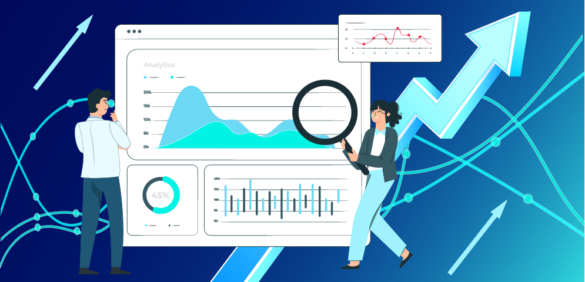

# NovumMart Sales Performance Report (2020 - 2025)

## Executive Summary
This analysis evaluates NovumMart's sales performance from 2020–2025. It identifies patterns in monthly sales trends, provides insights into sales performance by product category and sales method, and highlights key growth drivers as well as areas of concern such as sales, orders, customers, and return rates.

## Business Context
NovumMart’s management requires clear, data-driven reporting of their sales performance at the transaction level. The objective is to understand performance in order to support informed business decisions and optimize operations.

## Objectives
This report addresses the following key questions:
- What are the Key Performance Indicators (KPIs), and how have they changed over the years?
- Which product categories and geographical locations are driving sales, and which are lagging
- What are the preferred payment channels for customers?

## Data Overview
The analysis is based on a consolidated dataset of approximately 49,000 transactions and 16 columns, covering January 2020 to September 2025. It represents customer orders across all current operating locations.

## Data Preview

